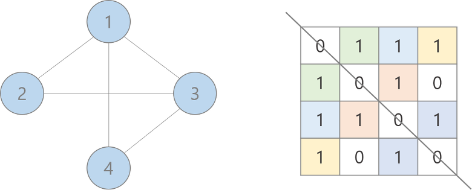
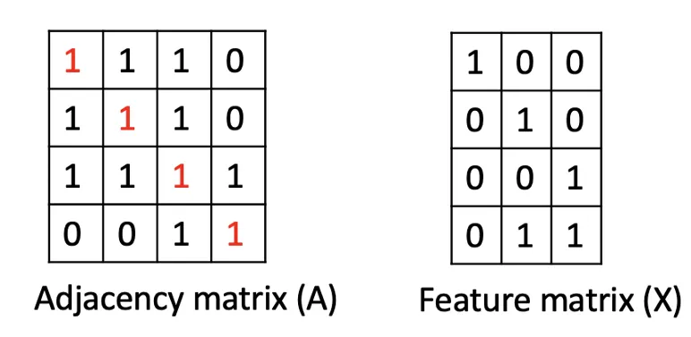
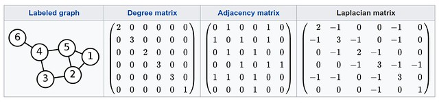
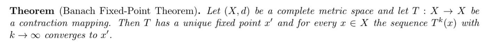
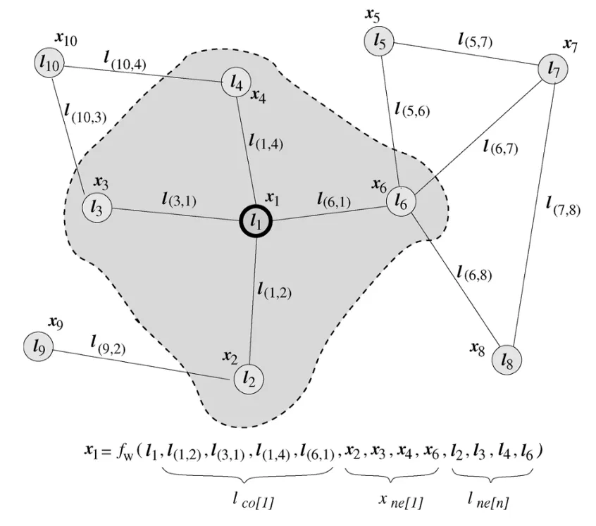
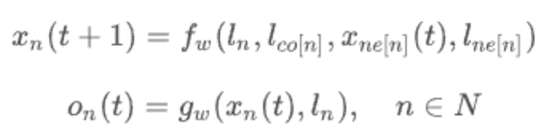
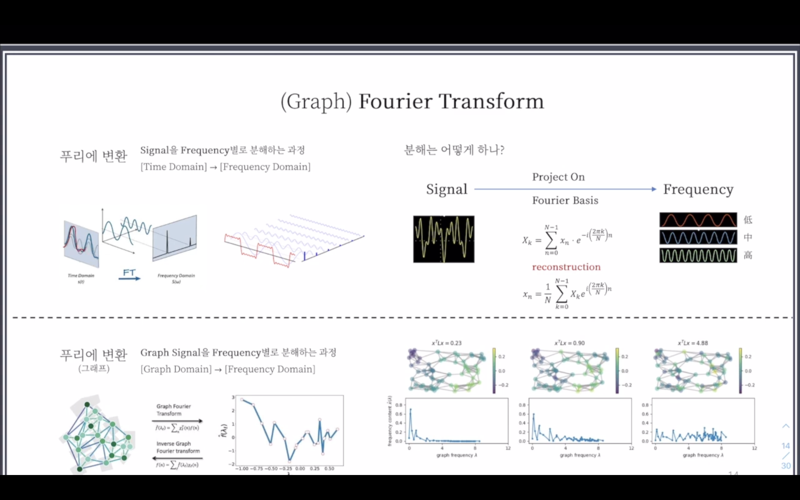
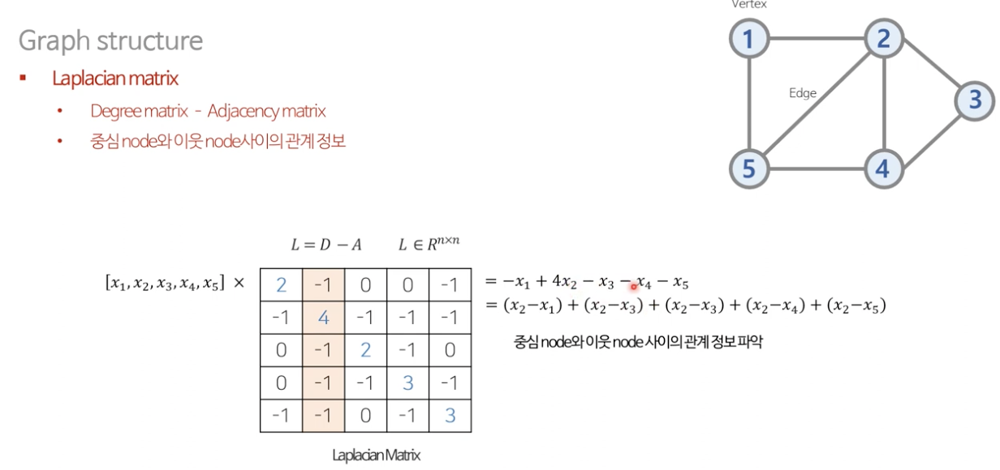

# GNN (Graph Neural Network)
## Graph란?
* 점과 점을 잇는 선으로 이루어진 데이터 구조로 관계나 상호작용을 나타내는 데이터를 분석할 때 주로 쓰인다.

### Graph의 표현
* adjacency matrix
  * node의 개수 : n
  * adjacency matrix의 차원 : n x n
   

      
   

* feature matrix
  * feature의 개수 : f
  * node의 개수 : n
  * feature matrix의 차원 : n x f
   

      
   

   

* Degree matrix
* Laplacian matrix

### 그래프를 분석하기 어려운 이유
1. 그래프는 **유클리드 공간에 있지 않음**
   * 좌표계로 매핑하기 어려워 해석이 비교적 어려움
2. 고정된 형태가 아님
   * 같은 인접 행렬로 표현된다고 해도 다르게 생길 수 있음
3. 사람이 해석할 수 있도록 시각화 하는 것이 어려움
   * 점의 개수가 매우 많아진다면 이를 쉽게 해석하긴 어렵다.

### 그래프를 사용하는 이유
그럼에도 불구하고 그래프를 사용하는 이유는 다음과 같다.
1. 관계, 상호작용과 같은 **추상적 개념**을 다루기 적합
   * 바이러스 전파 모델, SNS 관계 분석, 지식 그래프 등 관계를 분석할 땐 그래프가 유용하다.
2. Non-Euclidean Space의 표현과 학습이 가능하다.
   * SNS 관계나, 분자 구조와 같은 데이터는 유클리드 공간에 표현하기 어렵지만 그래프를 활용하면 해결할 수 있다. 

### 기존 그래프 분석 방법
학부 알고리즘 시간에 나오는 그래프 분석 방법들이다.

1. 검색 알고리즘 (BFS, DFS 등)
2. 최단 경로 알고리즘 (Dijkstra 알고리즘, A* 알고리즘 등)
3. 신장 트리 알고리즘 (Prim 알고리즘, Kruskal 알고리즘 등)
4. 클러스터링 방법 (연결 성분, 클러스터링 계수 등)

## Graph Neural Network
GNN은 이름에서 알 수 있듯이 그래프로 표현할 수 있는 데이터를 처리하기 위한 neural net의 종류이다.

> 그래프를 사용한다는 것은 **연결 여부**와 **연결 강도**를 중요하게 보겠다는 점과 같다. 이 연결 관계와 이웃들의 상태를 이용하여 각 점의 상태를 학습한다. 일반적으로 마지막 상태를 `node embedding`이라고 부른다. 

### 종류
GNN은 다음과 같은 세 가지로 분류할 수 있다. 
#### Recurrent Graph Neural Network
Vanilla GNN에서 소개된 Recurrent Graph Neural Network의 경우 Banach Fixed-Point Theorem을 기초로 만들어졌다.
> ##### Banach Fixed-Point Theorem
> 

   

> 어떤 조건 하에 mapping은 유일한 point를 가진다. 모든 점에 이 mapping을 무한번 적용하면 그 유일한 point로 수렴하는 것을 뜻한다.

위의 정의를 활용하여 iterative한 method로 recurrent GNN을 정의하면 다음과 같다.

   
   

이웃 노드들의 정보를 recurrent하게 전달하여 node state를 수렴할 때까지 업데이트한다.

#### Graph Convolution Network
일반적으로 CNN에서 Convolution Filter를 사용하는 이유는 다음과 같다.
1. 전체 데이터에서 **local feature**를 뽑아내는데 유용하다.
2. Filter들이 **Spatial location에 따라서 변하지 않는다.**

이러한 장점들을 graph에도 적용하여 하나의 노드와 인접 노드와의 관계를 계산하는 목적으로 고안되었다. 그러나 graph에서 convolution을 적용하기엔 몇가지 문제가 존재한다.
1. Convolution은 Regular Grid에 정의된다.
   * Graph는 그렇지 않다.
2. Filter가 모든 데이터에 대해서 같은 크기가 아니다.

그렇다면 convolution의 엄밀한 정의는 무엇일까?
> $$(f \ast g)(t):=\int_{-\infty}^{\infty} f(\tau) g(t-\tau) d \tau$$
> Convolution이란 두 함수의 합성곱으로 f와 g 중 하나의 함수를 반전 시킨 다음, 다른 하나의 함수와 곱한 결과를 적분한다. 때문에 현재의 합성곲의 값은 이전 시간의 결과를 포함한다.

일반적인 방법으론 graph에서 convolution 연산을 적용하기 쉽지 않아 보인다. 이것을 어떤 식으로 convolution 연산을 구현했는지에 따라 spectral과 spatial로 나뉜다.

##### 1. Spectral Convolutional Network
Spectral Convolution Network는 Fourier Transform의 개념을 활용한다.

   

한 Domain의 Convolution은 다른 Domain의 point-wise multiplication과 같다.
따라서 **Graph domain의 convolution은 Fourier domain의 point-wise multiplication**과 같다. 또한 **convolution의 Laplace 변환은 point-wise multiplication**으로 변한다. 

* GFT ➡️ Filtering ➡️ IGFT = Laplacian Matrix

Graph에서 Fourier transform이란 Graph signal을 frequency 별로 분해하는 과정이라고 생각하면 된다. **Graph signal을 feature**라 했을 때 **frequency는 feature 간의 차이**라고 볼 수 있다. 따라서 변환 후 **feature 간 차이를 계산했을 때 그 값이 크지 않은 쪽으로 filtering** 하는 것이 목표라 할 수 있다.

Spectral Convolutional Network은 graph signal에서 noise를 제거하기 위해 frequency의 spectrum에서 원하는 frequency를 filtering 한다.

이를 구현하기 위한 Laplacian Matrix는 `Degree matrix - Adjacency matrix`를 통해 구할 수 있다. 이 matrix를 활용하면 중심 node와 이웃 node와의 차이를 한번에 구할 수 있게 된다.

   

##### 2. Spatial Convolutional Network
Central node 주위 neighbor의 feature로 업데이트 한다. Spectral에 비해 계산이 간단하다. 고정된 크기의 이웃 node를 선택하여 convolution 연산을 수행한다. 

### GNN은 무엇을 할 수 있는가?
#### Node Classification
Node embedding을 통해 점들을 분류하는 문제를 해결할 수 있다. 일반적으로 그래프의 일부만 레이블 된 상황에서 semi-supervised learning을 한다고 한다.

#### Link Prediction
그래프의 점들 사이의 관계를 파악하고 두 점 사이에 얼마나 연관성이 있을지 예측하는 문제를 해결하는데 활용할 수 있다. 예를 들어 영화와 유저를 점으로 표현한다면 유저가 영화를 봤을 때 이 둘을 선으로 어어준다. 선으로 연결되지 않은 (영화, 유저) 쌍 중에 연결될 가능성이 높은 쌍을 찾아주는 문제라고 보면 된다.

#### Graph Classification
그래프 전체를 보고 여러 카테고리 중 하나로 분류하는 문제를 해결할 수 있다. 분자 구조 연구 등에 많이 활용된다.

### 추천 논문 및 자료
#### GCN
[Semi-Supervised Classification with Graph Convolutional Networks](https://arxiv.org/abs/1609.02907)

#### LightGCN
* [LightGCN: Simplifying and Powering Graph Convolution Network for Recommendation](https://arxiv.org/abs/2002.02126)

#### GraphSAGE
* [Inductive Representation Learning on Large Graphs
](https://arxiv.org/abs/1706.02216)
* [GraphSAGE (Inductive Representation Learning on Large Graphs) 설명](https://greeksharifa.github.io/machine_learning/2020/12/31/Graph-Sage/)

#### 요기요에서 GNN을 활용하여 추천시스템을 구축한 사례
* [[알잘딱깔센 추천 모델 만들기] — GNN을 활용한 요기요의 추천 모델 YoSEMITE](https://techblog.yogiyo.co.kr/%EC%95%8C%EC%9E%98%EB%94%B1%EA%B9%94%EC%84%BC-%EC%B6%94%EC%B2%9C-%EB%AA%A8%EB%8D%B8-%EB%A7%8C%EB%93%A4%EA%B8%B0-gnn%EC%9D%84-%ED%99%9C%EC%9A%A9%ED%95%9C-%EC%9A%94%EA%B8%B0%EC%9A%94%EC%9D%98-%EC%B6%94%EC%B2%9C-%EB%AA%A8%EB%8D%B8-yosemite-33b0600d2464)

#### PinSage
* [Graph Convolutional Neural Networks for Web-Scale Recommender Systems](https://arxiv.org/abs/1806.01973)
* [PinSAGE (Graph Convolutional Neural Networks for Web-Scale Recommender Systems) 설명](https://greeksharifa.github.io/machine_learning/2021/02/21/Pin-Sage/)
* [가짜연구소 - 추천시스템 스터디 : PinSage 리뷰](https://chanrankim.notion.site/PinSage-4f7944cd667844de8fe8ad7fb84a59c5)

#### PinnerSage
* [PinnerSage: Multi-Modal User Embedding Framework for Recommendations at Pinterest](https://arxiv.org/abs/2007.03634)
* [PinnerSage(Multi-modal user embedding framework for recommendations at pinterest) 요약 설명](https://greeksharifa.github.io/paper_review/2022/08/19/PinnerSage/)

#### node2vec
* [node2vec: Scalable Feature Learning for Networks](https://arxiv.org/abs/1607.00653)
#### Graph Convolutional Matrix Completion
: 유저-영화 평점 행렬이 있을 때 기존 평점을 기반으로 message passing function을 사용해서 아직 평가가 없는 유저-영화 쌍의 예상 평점을 계산
* [R. van den Berg, T. N. Kipf, and M. Welling, “Graph Convolutional Matrix Completion”, arXiv:1706.02263](https://arxiv.org/abs/1706.02263)

#### KGAT(Knowledge Graph Attention Network)
* [KGAT: Knowledge Graph Attention Network for Recommendation](https://arxiv.org/abs/1905.07854)
* [KGAT paper review(kor)](https://www.youtube.com/watch?v=I4mt5bP-IcQ)

#### NAVER DEVIEW 2021 
* [Knowledge Graph에게 맛집과 사용자를 묻는다. : GNN으로 맛집 취향 저격 하기!](https://deview.kr/2021/sessions/437)
* https://deview.kr/data/deview/session/attach/4_Stella_NAVER%20%E1%84%90%E1%85%A9%E1%86%BC%E1%84%92%E1%85%A1%E1%86%B8%20Knowledge%20Graph.pdf

#### Naver Knowledge Graph
* [데이터 분석 결과를 효과적으로 제공하기 위한 그래프 데이터베이스 구축](https://d2.naver.com/helloworld/8446520)

#### Toss Slash 2022 
* [Data Scientist는 어떻게 비즈니스에 기여할 수 있을까?](https://youtu.be/mKf1kvWXiPY?t=1200)
  * 20분부터 GNN을 검토하고 있는 이유에 대해 나온다.

---

## Reference
* [GNN 소개 — 기초부터 논문까지(WATCHA)](https://medium.com/watcha/gnn-%EC%86%8C%EA%B0%9C-%EA%B8%B0%EC%B4%88%EB%B6%80%ED%84%B0-%EB%85%BC%EB%AC%B8%EA%B9%8C%EC%A7%80-96567b783479)
* [[Paper Review] Semi-supervised Classification with Graph Convolutional Networks](https://www.youtube.com/watch?v=F-JPKccMP7k)
* [Graph Neural Networks 쉽게 이해하기](https://velog.io/@whattsup_kim/Graph-Neural-Networks-%EA%B8%B0%EB%B3%B8-%EC%89%BD%EA%B2%8C-%EC%9D%B4%ED%95%B4%ED%95%98%EA%B8%B0)
* [GNN 알고리즘 - (1) Recurrent GNN](https://didi-universe.tistory.com/entry/GNN-2Recurrent-GNN)
* [GNN 알고리즘 - (2) Spatial Convolutional Network](https://didi-universe.tistory.com/entry/GNN-%EC%95%8C%EA%B3%A0%EB%A6%AC%EC%A6%98-2-Spatial-Convolutional-Network)
* [Graph Convolutional Network에 대하여 - Spectral Graph Convolution](https://ralasun.github.io/deep%20learning/2021/02/15/gcn/)
* [GCN 기본 개념](https://huidea.tistory.com/301)